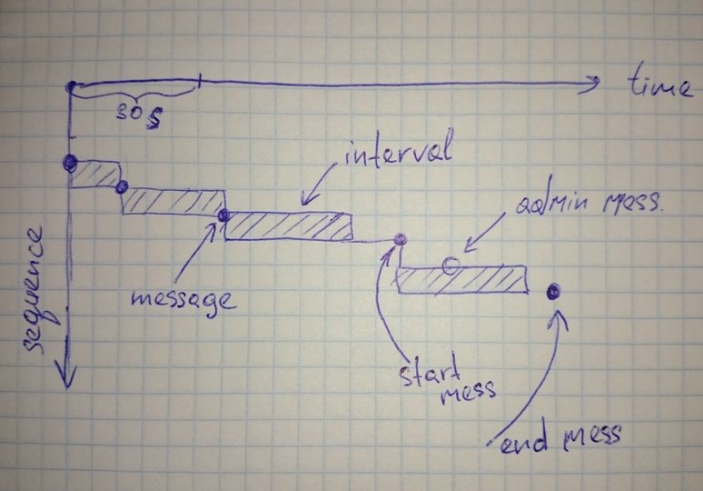

Интервалы в сообщениях
======================

Вот схема интервалов:

* Оцениваемой единицей разговора является интервал. Интервал - это периолд времени между двумя сообщениями, ограниченный 30 секундами.

* Если между двумя последовательными сообщениями менее или равно 30 сек., то интервал равен данному промежутку, иначе - 30 сек.

* В интервалах учитываются только сообщения клиента и модели. Служебные сообщения, сообщения админа и т.д. - не учитываюся.

* Интревал существует только между двумя сообщиниями, т.е. после последнего сообщения никакого интервала нет. 
    Например если в чате отправлено лишь одно сообщение - его длительность - 0 сек.